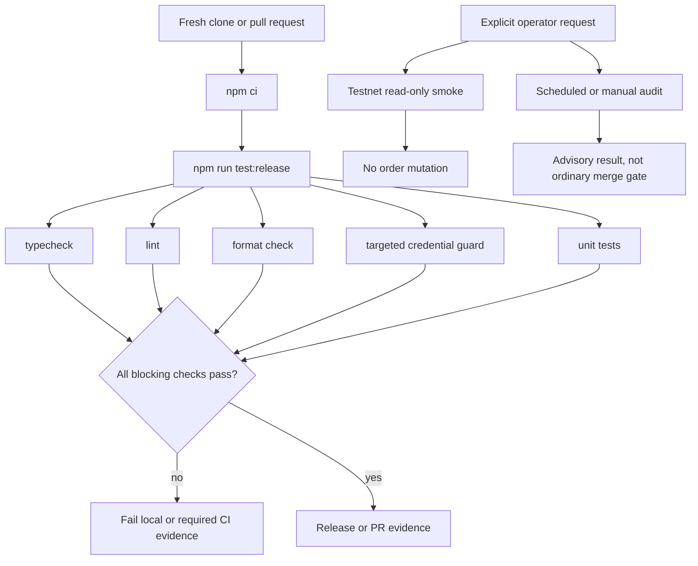

# Harden repository scaffold and deterministic CI - Plan

## Goal Capsule

- **Objective:** A fresh clone gives contributors one obvious, credential-free release check, and required CI rejects real code, formatting, test, and targeted credential-safety regressions before merge.
- **Means:** Extend the existing npm release script and GitHub Actions workflow with a repository-specific safety guard, while keeping Testnet smoke and dependency audit outside the ordinary blocking path (KTD1, KTD2, KTD3).
- **Authority:** Issue #6 acceptance criteria and out-of-scope boundaries are authoritative for product behavior; `docs/architecture/invariants.md` and `SECURITY.md` are mandatory safety constraints; current code and tests define existing behavior.
- **Stop conditions:** Stop and report a blocker if making the guard reliable requires broad heuristic secret scanning, exchange client implementation, credentialed default CI, a pre-commit framework, or a blocking dependency audit.
- **Execution profile:** Standard, security-sensitive repository workflow change. Use deterministic local fixtures and static workflow-contract tests. Do not invoke exchange writes.
- **Tail ownership:** The implementation branch, review, release checks, PR, and CI evidence are owned by the delivery pipeline after this plan.

---

## Product Contract

### Summary

Issue #6 hardens the repository scaffold so contributors can verify changes with one deterministic release command and CI can block the failures that matter. Credential protection remains targeted, default CI remains exchange- and credential-free, Testnet smoke remains opt-in, and dependency audit remains periodic or manual rather than a merge gate.

### Problem Frame

The repository already has strict TypeScript, lint, format, unit, release scripts, and a pull-request workflow, but the safety contract is not complete. The current scaffold does not execute a targeted repository credential guard, does not expose a separate Testnet smoke command, does not provide a non-blocking audit workflow, and presents the contributor command in more than one form.

### Requirements

#### Release and blocking CI

- R1. A fresh clone can run `npm ci && npm run test:release` as the documented pre-PR and release verification command.
- R2. The blocking release path fails when TypeScript type checking, lint, formatting, unit tests, or the targeted repository credential guard fails.
- R3. CI runs the blocking release path on pull requests and pushes to `main` with no exchange credentials and no exchange trading call.

#### Credential boundary

- R4. `.env.example` contains placeholders only, and local environment and credential artifacts remain ignored by default.
- R5. A targeted repository guard rejects tracked local credential files and tracked real Bybit credential material.
- R6. The credential guard does not use broad heuristic secret scanning or repository-history scanning.

#### Optional operational checks

- R7. A separate explicit command provides a read-only Testnet smoke check and is not part of `test:release` or default blocking CI.
- R8. Dependency/security audit is available from an npm command and a periodic or manually triggered workflow without becoming an ordinary merge gate.

#### Contributor workflow

- R9. Issue forms and the pull-request template remain valid, lightweight guidance and do not add heavy mandatory process fields.
- R10. Contributor documentation makes the single pre-PR verification command obvious and identifies optional Testnet and audit checks separately.

### Key Decisions

- **Blocking CI focuses on type, lint, format, tests, and targeted credential safety.** This follows the product-owner interview in issue #6 and avoids low-signal blocking checks. Governs R2 and R3.
- **Secret protection is targeted to known repository credential surfaces.** Broad heuristic and history scanning are excluded because they create false positives and are not required for this story. Governs R4, R5, and R6.
- **Testnet smoke is explicit and read-only.** It provides an opt-in connectivity signal without adding exchange mutation or making credentials part of default CI. Governs R3 and R7.
- **Audit is periodic or manual and non-blocking.** Audit visibility is useful, but ordinary merge readiness must not depend on an external advisory feed. Governs R8.
- **Issue and pull-request templates remain guidance.** The repository should improve discoverability without turning a small delivery workflow into bureaucracy. Governs R9 and R10.

### Actors

- **A1. Contributor:** runs the documented release command and optional local checks before opening a pull request.
- **A2. Pull-request CI runner:** executes only credential-free blocking checks against the proposed repository state.
- **A3. Repository maintainer:** receives actionable blocking failures and optional audit results without approving exchange access.

### Key Flows

- F1. **Pre-PR verification**
  - **Trigger:** A contributor prepares a fresh clone or a change for review.
  - **Actors:** A1
  - **Steps:** Install from the lockfile, run the single release command, and investigate any failing quality or safety check.
  - **Outcome:** The contributor has local evidence matching the blocking CI path.
  - **Covered by:** R1, R2, R10

- F2. **Blocking pull-request check**
  - **Trigger:** A pull request or push to `main` starts the default workflow.
  - **Actors:** A2, A3
  - **Steps:** Install with the lockfile, run the release path, and fail the check on a required negative result.
  - **Outcome:** Required code and targeted credential regressions cannot pass the blocking workflow.
  - **Covered by:** R2, R3, R5

- F3. **Optional operational checks**
  - **Trigger:** A contributor or maintainer explicitly requests a Testnet smoke or audit run.
  - **Actors:** A1, A3
  - **Steps:** Run the selected optional command or manually dispatch the audit workflow.
  - **Outcome:** The optional signal is available without granting default CI exchange access or making audit status a merge prerequisite.
  - **Covered by:** R7, R8

### Acceptance Examples

- AE1. **Required release failure:** Given a fresh checkout, when any type, lint, format, unit-test, or credential-guard check is made to fail in isolation, then `npm run test:release` and the blocking CI job fail.
- AE2. **Safe credential fixture:** Given `.env.example` and placeholder-only configuration, when the guard scans the repository, then it passes without treating placeholders as real credentials.
- AE3. **Unsafe credential fixture:** Given a tracked `.env` or a tracked file containing non-placeholder `BYBIT_API_KEY` and `BYBIT_API_SECRET` values, when the guard scans the repository, then it fails with an actionable path-based error and does not print secret values.
- AE4. **Default CI isolation:** Given the default CI workflow, when its source and executed commands are inspected, then no exchange secret reference, Testnet smoke invocation, or trading endpoint call is present.
- AE5. **Opt-in Testnet smoke:** Given no opt-in invocation, when the default release command runs, then no Testnet network request occurs; given an explicit Testnet smoke invocation, then only the configured Testnet read-only check is attempted and a mainnet configuration is rejected.
- AE6. **Optional audit:** Given the audit workflow, when it is manually dispatched or scheduled, then it runs separately from pull-request blocking CI and an advisory failure does not fail ordinary merge checks.
- AE7. **Lightweight templates:** Given the issue forms and pull-request template, when their repository files are inspected as GitHub configuration, then the forms have required core story fields and the pull-request template points to the single release command without adding heavyweight mandatory workflow fields.

### Success Criteria

- S1. `npm ci && npm run test:release` succeeds in a fresh clone with no credentials or exchange access.
- S2. The blocking CI workflow has one obvious release-check path and its failure signal covers all required checks.
- S3. A targeted negative credential fixture fails before merge evidence while a placeholder fixture passes.
- S4. Testnet smoke and dependency audit are discoverable, explicitly invoked, and isolated from the blocking path.
- S5. Contributors can identify the pre-PR command from `README.md`, `CONTRIBUTING.md`, and the pull-request template without guessing.

### Scope Boundaries

#### Deferred to Follow-Up Work

- macOS Keychain or equivalent OS-vault credential loading remains in issue #49.
- Exchange adapter implementation and authenticated Testnet execution remain future delivery work.

#### Outside this product's identity

- No live or Testnet mutation in default CI.
- No pre-commit hook framework.
- No broad heuristic secret scanner or repository-history scanner.
- No blocking dependency/security audit.
- No heavyweight quality gate without a demonstrated failure mode.

### Dependencies

- Node.js 22+ and npm 10+ remain the supported local runtime.
- `package-lock.json` remains the installation source for reproducible `npm ci`.
- GitHub Actions remains the CI host and uses the repository's existing checkout and setup-node conventions.
- The Testnet smoke depends on the public Bybit Testnet read-only time endpoint, but it must not depend on exchange credentials or an order-writing adapter.

### Sources / Research

- [Issue #6](https://github.com/olegeech/crypto-analyst-trader/issues/6) — source of the outcome, acceptance criteria, product-owner decisions, verification requirements, and non-goals.
- `package.json`, `package-lock.json`, `tsconfig.json`, `eslint.config.js`, `src/index.ts`, and `tests/smoke.test.ts` — current release path and minimal TypeScript/test patterns.
- `.github/workflows/ci.yml`, `.github/workflows/issue-status.yml`, `.github/ISSUE_TEMPLATE/*.yml`, and `.github/pull_request_template.md` — current GitHub workflow and contributor configuration.
- `docs/architecture/invariants.md`, `docs/product-principles.md`, `SECURITY.md`, `docs/workflow.md`, and `CONTRIBUTING.md` — mandatory safety and delivery boundaries.
- [GitHub Actions workflow events](https://docs.github.com/en/actions/reference/workflows-and-actions/events-that-trigger-workflows), [GITHUB_TOKEN least permissions](https://docs.github.com/en/actions/tutorials/authenticate-with-github_token), and [GitHub secret scanning custom patterns](https://docs.github.com/en/code-security/how-tos/secure-your-secrets/customize-leak-detection/define-custom-patterns) — current external constraints supporting separate manual/scheduled workflows, least-privilege defaults, and targeted rather than broad secret detection.

---

## Planning Contract

### Key Technical Decisions

- KTD1. Make `test:release` the single blocking composition and add the targeted repository guard to that composition. Keep CI as one release-check job so local and CI evidence use the same contract.
- KTD2. Implement the credential guard as an explicit allowlist of sensitive path forms plus exact Bybit credential-field checks that distinguish empty or documented placeholders from non-placeholder values. Scan the tracked working tree and never print matched contents.
- KTD3. Implement Testnet smoke as a separate no-credentials Node command that validates Testnet configuration and performs only a read-only public health/time request. Reject mainnet configuration before any request.
- KTD4. Implement audit as a separate npm script and GitHub Actions workflow with `workflow_dispatch` and a low-frequency schedule. Keep it outside `ci.yml` and make its advisory failure visible without making it a required pull-request check.
- KTD5. Extend existing documentation and template wording only where it improves command discoverability. Do not add a new documentation subsystem or process framework.

### High-Level Technical Design

The default path has no secret-bearing environment mapping and no Testnet or audit invocation. The guard operates on repository-tracked paths and file contents with targeted rules. Optional commands are separate entry points so their network or advisory behavior cannot be reached accidentally by the blocking release command.

### Assumptions

- The existing `ci.yml` job is the only ordinary blocking CI job that needs to change for this story.
- A read-only public Testnet endpoint is sufficient for the scaffold-level smoke contract because authenticated exchange adapter behavior is explicitly out of scope.
- GitHub repository settings, such as branch protection and Secret Protection enablement, are maintainer configuration outside the repository diff. The repository will not claim that a settings-only feature is enabled by code.
- Local credential guard fixtures can use temporary repositories and synthetic values that are clearly non-production. No real key or secret will be added to the repository or test output.

### Sequencing

1. Establish the shared package scripts and blocking CI contract.
2. Add the targeted credential guard, ignore rules, and deterministic negative fixtures.
3. Add isolated Testnet smoke and audit entry points with contract tests.
4. Make README, CONTRIBUTING, and pull-request guidance point to the same release command.
5. Run release verification, inspect the diff for secret/network regressions, and prepare the PR evidence.

### System-Wide Impact

- **CI authority:** `test:release` becomes the shared local and CI contract. Changes to its composition affect all contributors and required checks.
- **Credential boundary:** The guard must fail closed for known credential surfaces while avoiding false positives from placeholders, docs, lockfiles, and ordinary application text.
- **Network boundary:** Default CI and release tests remain credential-free and must not reach exchange trading endpoints. Optional smoke is the only new exchange-network path.
- **Operational posture:** Audit results are informational and may be delayed or unavailable without blocking ordinary delivery.

### Risks & Dependencies

- **False positives in the targeted guard:** Overly broad matching could block safe fixtures or documentation. Mitigate with explicit path rules, placeholder cases, synthetic negative fixtures, and errors that identify only paths and rule names.
- **False negatives in credential detection:** A new credential representation may evade the initial allowlist. Keep the guard intentionally narrow and document the covered Bybit fields so future coverage is issue-driven rather than heuristic.
- **Optional network flakiness:** Testnet availability can vary. Keep it out of `test:release`, reject unsafe configuration before network access, and make the command's failure explicit.
- **Audit signal drift:** Advisories and registry availability change. Keep audit separate, visible, and non-blocking as required by issue #6.
- **Workflow contract drift:** GitHub event and permission behavior is external. Keep default permissions read-only and test workflow source for secret and optional-command isolation.

---

## Implementation Units

### U1. Compose the blocking release contract

**Goal:** Make the existing local release command the exact contract used by blocking CI, with required checks ordered clearly and without exchange access.

**Requirements:** R1, R2, R3, S1, S2.

**Dependencies:** None.

**Files:** `package.json`, `.github/workflows/ci.yml`, `tests/ci-contract.test.ts`.

**Approach:**

1. Preserve the existing Node 22 and lockfile-based install flow.
2. Keep typecheck, lint, format check, and unit tests in `test:release`.
3. Add the repository safety check as a required release step without adding a second blocking workflow.
4. Keep CI permissions read-only and do not expose `secrets` or Bybit credential variables.

**Patterns to follow:** Existing `test:release` composition in `package.json`; existing `release-checks` job in `.github/workflows/ci.yml`; Node test style in `tests/smoke.test.ts`.

**Test scenarios:**

- Given the package manifest, the release script includes type, lint, format, credential-guard, and unit-test stages in a deterministic order.
- Given the CI workflow, the blocking job installs with `npm ci` and invokes only `npm run test:release` after checkout and Node setup.
- Given the CI workflow source, no secret context, Bybit credential variable, Testnet smoke command, or trading endpoint appears in the default job.
- Given synthetic failing commands in a temporary package fixture, the corresponding release composition propagates a non-zero exit instead of masking the failure.

**Verification:** The release script and CI workflow contract tests pass, and the full release command fails when any required constituent check is deliberately made invalid in a temporary fixture.

---

### U2. Add targeted credential repository protection

**Goal:** Block accidental tracking of local credential files and real Bybit credential material without introducing broad secret scanning.

**Requirements:** R4, R5, R6, S3.

**Dependencies:** U1.

**Files:** `.gitignore`, `.env.example`, `scripts/check-repository-safety.mjs`, `tests/repository-safety.test.ts`.

**Approach:**

1. Keep `.env.example` as the sole tracked environment template and retain placeholder-only values.
2. Extend ignore rules for the explicitly supported local credential artifact names and directories without hiding general source files.
3. Have the guard inspect tracked paths from the current repository state and inspect only exact Bybit credential fields for non-placeholder values.
4. Return a failing result that names the rule and path, while redacting all matched values.

**Patterns to follow:** Existing `.env*` and `data/private/` protections in `.gitignore`; placeholder semantics in `.env.example`; runtime secret boundary in `SECURITY.md` and invariants 9, 14, 17, and 19.

**Execution note:** Add characterization-style safe and unsafe fixtures before tuning the guard rules. The negative cases must prove both file-path rejection and real-value rejection.

**Test scenarios:**

- Given a temporary repository containing `.env.example` with empty or documented placeholder values, the guard exits successfully.
- Given a tracked `.env`, `.env.local`, credential directory file, or explicitly covered key file, the guard exits non-zero and reports the path without file contents.
- Given a tracked file with non-placeholder `BYBIT_API_KEY` and `BYBIT_API_SECRET` assignments, the guard exits non-zero and does not print either synthetic value.
- Given a tracked file containing generic words such as `apiKey`, test fixtures, or documentation examples without an exact real Bybit credential assignment, the guard does not fail by heuristic.
- Given an ignored local credential file that is not tracked, the guard does not treat its presence alone as a repository leak.
- Given a malformed or unreadable tracked file fixture, the guard fails closed with a path-only diagnostic rather than throwing raw content.

**Verification:** Targeted safety tests pass, `.env.example` contains no non-placeholder values, and running the guard against the repository's tracked files succeeds without network access or credential output.

---

### U3. Isolate Testnet smoke and dependency audit

**Goal:** Provide explicit optional operational checks while preserving a credential-free, non-network, non-audit blocking release path.

**Requirements:** R3, R7, R8, S4.

**Dependencies:** U1.

**Files:** `package.json`, `scripts/testnet-smoke.mjs`, `.github/workflows/security-audit.yml`, `tests/optional-checks.test.ts`.

**Approach:**

1. Add a Testnet smoke command that validates the environment before making a read-only public Testnet request.
2. Reject mainnet or missing/invalid Testnet configuration before network access and never submit an order.
3. Add a dependency audit npm entry point that uses the lockfile and remains separate from `test:release`.
4. Add a manually dispatchable and scheduled audit workflow with read-only permissions and advisory failure handling.

**Patterns to follow:** Existing `.env.example` Testnet base URL; separation of preparation and execution in `docs/architecture/system-design.md`; GitHub `workflow_dispatch` and `schedule` semantics in the official workflow-events documentation.

**Test scenarios:**

- Given the default release command, no Testnet smoke or audit script is invoked and no network request is attempted.
- Given explicit Testnet configuration, the smoke command calls only the read-only Testnet health/time endpoint and accepts a valid response.
- Given mainnet configuration, the smoke command fails before making a request.
- Given missing or malformed Testnet configuration, the smoke command fails with an actionable configuration diagnostic and no request.
- Given the audit workflow source, it has manual and scheduled triggers, no exchange credentials, no trading command, and no dependency on the blocking CI workflow.
- Given a simulated audit failure, the optional workflow reports the failure without changing ordinary pull-request required-check status.

**Verification:** Optional-check contract tests pass; the default release path remains network-free; the Testnet command is not run during standard verification; the audit workflow is structurally separate and advisory.

---

### U4. Align contributor guidance and lightweight GitHub templates

**Goal:** Make the release command obvious across contributor surfaces while preserving the existing lightweight issue and pull-request workflow.

**Requirements:** R9, R10, S5, AE7.

**Dependencies:** U1, U2, U3.

**Files:** `README.md`, `CONTRIBUTING.md`, `.github/pull_request_template.md`, `.github/ISSUE_TEMPLATE/story.yml`, `.github/ISSUE_TEMPLATE/config.yml`, `tests/contributor-guidance.test.ts`.

**Approach:**

1. Present `npm ci && npm run test:release` as the single pre-PR and release command.
2. Describe Testnet smoke and dependency audit as separate opt-in checks without implying they are required for ordinary merges.
3. Keep story issue fields focused on outcome, scope, acceptance, safety, relationships, and verification.
4. Keep the pull-request template's safety prompts and release evidence checkbox, changing only wording needed for command discoverability.

**Patterns to follow:** Existing README development section; existing `CONTRIBUTING.md` verification section; current story form and pull-request template.

**Test scenarios:**

- Given `README.md`, `CONTRIBUTING.md`, and `.github/pull_request_template.md`, the same release command is visible and no conflicting pre-PR command is presented.
- Given the contributor documents, optional Testnet and audit checks are clearly separate from blocking release verification.
- Given the story issue form, core product-owner and safety fields remain required and no new heavyweight process field is introduced.
- Given the issue-template configuration, blank issues remain disabled and the workflow guidance contact remains valid.
- Given the pull-request template, issue closure, evidence, safety impact, residual risk, and exchange-write safety prompts remain available.

**Verification:** Documentation and template contract tests pass, all referenced commands exist in `package.json`, and the files render as valid lightweight GitHub guidance by inspection.

---

## Verification Contract

| Gate                                  | Command or evidence                                                                                      | Applies to | Pass signal                                                                                       |
| ------------------------------------- | -------------------------------------------------------------------------------------------------------- | ---------- | ------------------------------------------------------------------------------------------------- |
| Clean install                         | `npm ci`                                                                                                 | U1-U4      | Lockfile install succeeds in a fresh clone without credentials.                                   |
| Release checks                        | `npm run test:release`                                                                                   | U1-U4      | TypeScript, lint, format, targeted safety guard, and unit tests all pass.                         |
| Targeted negative safety              | `node --test tests/repository-safety.test.ts`                                                            | U2         | Placeholder fixtures pass and tracked credential fixtures fail without leaking values.            |
| Workflow and optional-check contracts | `node --test tests/ci-contract.test.ts tests/optional-checks.test.ts tests/contributor-guidance.test.ts` | U1, U3, U4 | Default CI is isolated, optional workflows are separate, and guidance stays aligned.              |
| Testnet smoke                         | Explicit local invocation only                                                                           | U3         | Read-only Testnet smoke succeeds only under safe Testnet configuration; it is not run by default. |
| Dependency audit                      | Explicit local invocation or manual/scheduled workflow                                                   | U3         | Audit is available and advisory; its failure does not become a required ordinary PR check.        |
| Repository diff safety                | Review of changed paths and workflow source                                                              | U1-U4      | No real secret, private account artifact, exchange-write path, or unrelated cleanup is present.   |

The final evidence must include the successful fresh-clone release command, targeted negative fixture results, proof that default CI has no credential or trading-network path, and confirmation that optional checks are isolated.

---

## Definition of Done

- R1-R10 and S1-S5 have implementation or test evidence in the branch.
- `npm ci && npm run test:release` passes from a fresh clone.
- Deliberate type, lint, format, unit-test, and targeted credential failures are proven to fail the blocking contract.
- `.env.example` remains placeholder-only, local credential artifacts remain ignored, and the guard never prints secret values.
- Default CI has no exchange credentials, no Testnet smoke invocation, and no exchange trading call.
- Testnet smoke is explicit, read-only, configuration-gated, and absent from default release checks.
- Dependency/security audit is available manually or periodically and is not a blocking merge gate.
- Issue forms and the pull-request template remain valid, lightweight, and aligned with the documented contributor flow.
- No exchange client, live mutation, pre-commit framework, broad secret scanner, history scanner, or unrelated cleanup is introduced.
- Abandoned experimental code, temporary fixtures, and dead-end configuration are removed before the branch is considered complete.
- The pull request closes issue #6 and records residual work as a separate issue when any remains.
